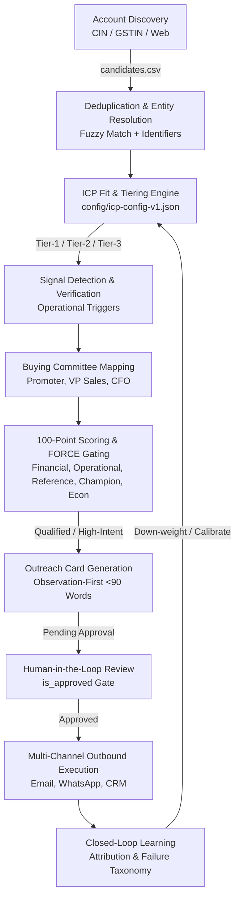

# Enterprise Master GTM Intelligence System

> **A forensic, evidence-backed Go-To-Market (GTM) intelligence and execution pipeline for high-value enterprise solution studios.**
> Targets mid-market manufacturers (₹500–2,000 Cr) by uncovering real operational friction (ERP/DMS bypass, distributor reconciliation delays) rather than relying on digital vanity metrics.

---

## 1. System Overview & Philosophy

Most B2B outbound fails because it relies on generic SaaS scrapers (Clay, Apollo, ZoomInfo) that treat website traffic and digital headcount as buying intent. In traditional manufacturing, the real pain points live offline:
* **The Operating Reality**: ERPs (SAP/Tally) and Distributor Management Systems (DMS) exist, but field sales reps and 200–500+ dealers routinely bypass them using WhatsApp and paper notes.
* **The Consequence**: Stretched debtor days, rebate calculation discrepancies, stockout blindspots, and massive month-end reconciliation friction.
* **The Strategic Wedge**: A non-invasive, 8-week operational slice with pre-agreed P&L metrics, control groups, and an explicit kill-line.

---

## 2. End-to-End Architecture: How It Is Built

The system is architected as an algorithmic, modular pipeline driven by a local Python CLI (`engine/gtm_engine.py`) and an SQLite operational store (`engine/gtm.db`).



### Key Modules & Capabilities

1. **Account Discovery & Deduplication (`engine/gtm_engine.py`)**:
   * Resolves duplicate records across CIN, GSTIN, normalized phone numbers, and fuzzy company names (Jaro-Winkler 0.88 threshold).
2. **ICP Rules Engine (`config/icp-config-v1.json`)**:
   * Evaluates revenue bands, employee thresholds, dealer network counts, and geography (North, West, South clusters) to categorize accounts into **Tier-1** (immediate fit), **Tier-2** (nurture/upper-mid), and **Tier-3** (watch).
3. **100-Point Scoring & FORCE Qualification**:
   * Scores accounts across 9 dimensions: ICP Fit (20), Problem Gravity (20), Trigger Recency (15), Pain Evidence (15), Buyer Accessibility (10), Solution Feasibility (5), Pilot Fit (5), Engineering Feasibility (5), Commercial Realism (5).
   * Enforces **FORCE Hard Gates**:
     * **F** (Financial Owner): Named economic sponsor (Promoter/Director/CFO).
     * **O** (Operational Bottleneck): Documented physical friction (claims, stockouts, reporting delays).
     * **R** (Referenceable Proof): Direct analogous case match (field sales tracking, voice automation, or enterprise reconciliation).
     * **C** (Internal Champion): Access to business head or ASM.
     * **E** (Clear Unit Economics): Estimated ROI > 5x cost.
4. **Deep Research Dossiers (`accounts/deep-research/`)**:
   * In-depth dossiers for Tier-1 accounts detailing corporate structure, plant locations, dealer network, current tech stack, and exact entry angles.
5. **Observation-First Outreach Playbook**:
   * Strict message structure (<90 words):
     $$\text{Dated Public Observation} \rightarrow \text{Operational Hypothesis} \rightarrow \text{Relevant Verified Metric} \rightarrow \text{Low-Friction Question}$$

---

## 3. What Needs Connection to Make It Fully Operational

The system's core intelligence, validation rules, and evaluation benchmarks are complete. To turn it into a live, fully automated production motion, the following 5 components must be connected:

```
[1. Scrapers / Discovery APIs] ──> Ingest raw candidates
[2. Enrichment APIs]          ──> Direct executive phone & verified emails
[3. Review UI (Streamlit)]    ──> 1-Click human approve / edit / kill
[4. Outbound Sequencer & CRM] ──> Smartlead / WhatsApp / HubSpot sync
[5. Webhook Feedback Loop]    ──> Ingest replies/kills into failure taxonomy
```

1. **Discovery Ingestion**:
   * Connect automated scrapers or search scripts to feed fresh candidates weekly into `accounts/candidates.csv`.
2. **Contact Enrichment & Verification APIs**:
   * **Mobiles**: Connect **EasyLeadz** API to enrich direct mobile/WhatsApp numbers of Promoters and VP Sales.
   * **Emails**: Connect **Hunter** (email pattern detection) + **MillionVerifier** API (<$1/100 accounts) to guarantee deliverability.
3. **Human-in-the-Loop (HITL) Dashboard**:
   * Launch an interactive interface (e.g., Streamlit) where operators review the generated pitch cards and toggle `is_approved = 1` before dispatch.
4. **Outbound Sequencer & CRM Sync**:
   * Connect an email sequencer (**Smartlead** or **Instantly**) with warmed secondary domains for executive email.
   * Connect **HubSpot API** to sync contacts, accounts, and deal stages across the custom 6M sales lifecycle (M0 to M5).
5. **Closed-Loop Feedback Webhook**:
   * Ingest campaign webhooks (Replies, Bounces, Explicit Kills) to automatically tag failure reasons in `gtm.db` and auto-tune scoring weights.

---

## 4. Future Additions for a State-of-the-Art System

To leap from standard automation to state-of-the-art forensic intelligence:

### A. Credit Rating Agency (CRA) & Financial Extraction
* **The Insight**: Credit rating reports (CRISIL, ICRA, CARE) are goldmines containing exact debtor days, dealer counts, working capital stretch, and bank loan facilities.
* **Implementation**: Deploy **[Docling](https://github.com/DS4SD/docling)** (IBM) to extract complex financial tables and liquidity rationales from 100-page PDFs into clean Markdown.

### B. Stealth Open-Source Discovery Stack
* **[Scrapling](https://github.com/D4Vinci/Scrapling)**: Uses Camoufox stealth browsers and adaptive DOM selectors to extract company listings from marketplace directories while evading Cloudflare blocks.
* **[Crawl4AI](https://github.com/unclecode/crawl4ai)**: LLM-friendly crawler for corporate press releases and quarterly earnings decks.
* **[SearXNG](https://github.com/searxng/searxng)**: Self-hosted meta-search engine eliminating paid SERP API costs.

### C. Autonomous Subagent Assembly Line
Replace monolithic workflows with specialized subagents:
* **Scout Subagent**: Discovers and deduplicates candidate companies.
* **Forensic Auditor Subagent**: Parses rating PDFs and balance sheets for operational red flags.
* **Red-Team Critic Subagent**: Challenges the hypothesis and checks for contradiction against public evidence.
* **Outbound Architect Subagent**: Generates strict, schema-validated Pydantic output using **[Instructor](https://github.com/jxnl/instructor)**.

---

## 5. Quickstart & CLI Commands

The engine is controlled via `engine/gtm_engine.py`:

```bash
# 1. Initialize SQLite database
python engine/gtm_engine.py init --db engine/gtm.db

# 2. Ingest candidate accounts
python engine/gtm_engine.py load-candidates accounts/candidates.csv --db engine/gtm.db

# 3. Deduplicate accounts (CIN, GSTIN, fuzzy name matching)
python engine/gtm_engine.py dedup --db engine/gtm.db

# 4. Score and classify ICP Fit (Tier 1/2/3)
python engine/gtm_engine.py fit --db engine/gtm.db

# 5. Run 100-pt qualification and FORCE hard gates
python engine/gtm_engine.py qualify --db engine/gtm.db

# 6. Generate outreach-ready cards (approved=FALSE by default)
python engine/gtm_engine.py outreach --db engine/gtm.db

# 7. Export outreach queue to CSV
python engine/gtm_engine.py export --table outreach_ready --out accounts/outreach-ready.csv --db engine/gtm.db

# 8. Sync living state manifest
python scripts/update_state.py --note "Refreshed live pipeline"
```

---

## 6. Repository Layout

```
gtm-system/
├── README.md               # Master system documentation (this file)
├── .gitignore              # Ignores Python caches, DB temp files, and local markdown docs
├── accounts/
│   ├── candidates.csv      # Raw discovered accounts
│   └── outreach-ready.csv  # Verified, qualified outreach queue
├── config/
│   └── icp-config-v1.json  # ICP definitions, weights, and scoring rules
├── design/
│   └── schemas.sql         # Core relational SQLite/Postgres schema
├── engine/
│   ├── gtm.db              # Live SQLite pipeline database
│   └── gtm_engine.py       # Core pipeline execution engine
├── eval/
│   └── gold-set.csv        # 10-account gold evaluation benchmark
├── final/
│   └── dashboard.html      # Visual executive pipeline dashboard
├── scoring/
│   └── icp-scorecard.csv   # Scoring matrix comparisons
└── scripts/
    └── update_state.py     # State synchronizer and file indexer
```

---

## 7. License & Attribution

Internal Go-To-Market System. All rights reserved.
